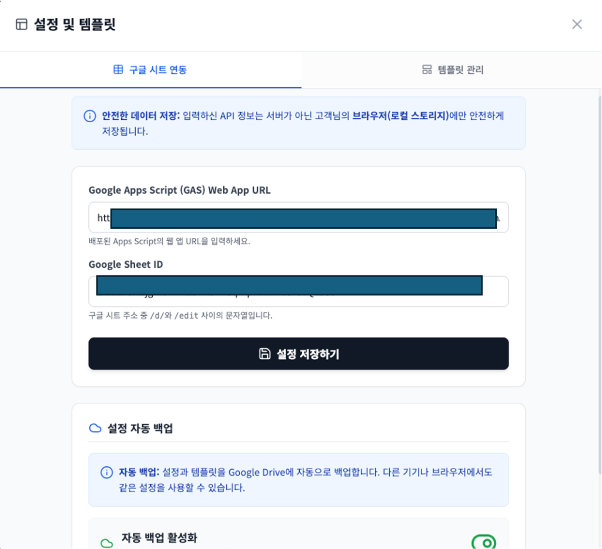
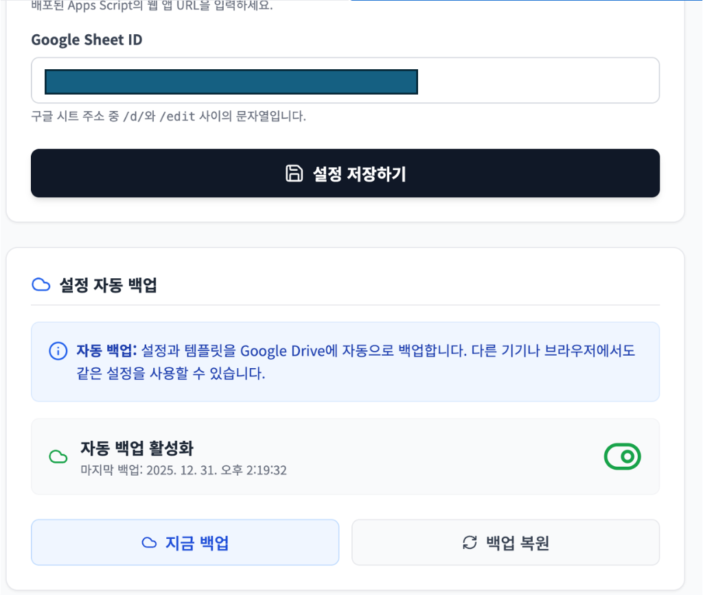

# 🛒 PageGenie (AI 상품 페이지 자동 생성)

**PageGenie**는 Google Gemini API(Multimodal)를 활용하여 이커머스 상품 상세페이지를 자동으로 기획, 디자인, 생성 및 현지화하는 웹 애플리케이션입니다.


## 1. 프로젝트 개요

이 프로젝트는 React 기반의 단일 페이지 애플리케이션(SPA)으로, 별도의 백엔드 서버 없이 **Google Apps Script (GAS)**를 활용하여 Serverless 환경에서 동작합니다.

### 🎯 핵심 기능
1. **Mode A: 신규 생성 (Creation)**
   - 상품 사진을 업로드하면 AI가 특징을 분석하여 마케팅 문구 작성 및 섹션 기획.
   - 각 섹션에 적합한 고퀄리티 이미지를 AI가 생성.
2. **Mode B: 현지화 (Localization)**
   - 해외 상세페이지 스크린샷을 한국어 마케팅 문구로 변환.
   - 원본 레이아웃을 유지하며 텍스트만 자연스럽게 교체.

---

## 2. 시작하기 (Getting Started)

이 프로젝트를 로컬 환경에서 실행하기 위한 방법입니다.

### 사전 요구사항
*   Node.js (최신 LTS 버전 권장)
*   npm

### 설치 및 실행

1. **저장소 클론 (Clone)**
   ```bash
   git clone https://github.com/710814/PageGenie-Public.git
   cd PageGenie-Public
   ```

2. **의존성 설치**
   ```bash
   npm install
   ```

3. **환경 변수 설정**
   루트 디렉토리에 `.env` 파일을 생성하고 Gemini API 키를 설정합니다. (GAS 프록시 사용 시 생략 가능하나 개발 편의를 위해 권장)
   ```bash
   VITE_GEMINI_API_KEY=your_api_key_here
   ```

4. **개발 서버 실행**
1.  **저장소 클론 (Clone)**
    ```bash
    git clone https://github.com/710814/PageGenie-Public.git
    cd PageGenie-Public
    ```

2.  **의존성 설치**
    ```bash
    npm install
    ```

3.  **환경 변수 설정**
    루트 디렉토리에 `.env` 파일을 생성하고 Gemini API 키를 설정합니다. (GAS 프록시 사용 시 생략 가능하나 개발 편의를 위해 권장)
    ```bash
    VITE_GEMINI_API_KEY=your_api_key_here
    ```

4.  **개발 서버 실행**
    ```bash
    npm run dev
    ```

---

### 3. Google Apps Script (GAS) 설정

⚠️ **중요**: 이 앱은 이미지 저장 및 데이터 관리를 위해 Google Apps Script 설정이 필수입니다.

#### 1단계: GAS 프로젝트 생성 및 코드 적용
1. [Google Apps Script](https://script.google.com/)에서 새 프로젝트를 생성합니다.
2. `GOOGLE_APPS_SCRIPT_CODE.js` 파일의 전체 내용을 복사하여 GAS 프로젝트의 `Code.gs`에 붙여넣습니다.

#### 2단계: Gemini API 키 설정
GAS 프로젝트 설정(톱니바퀴 아이콘) > **스크립트 속성(Script Properties)**에서 다음 속성을 추가합니다.
- **속성**: `GEMINI_API_KEY`
- **값**: `AIzaSy...` (발급받은 Gemini API 키)

#### 3단계: 웹 앱 배포
1. **배포** > **새 배포** > **웹 앱** 선택.
2. **실행 대상**: `나 (Me)` (중요: 그래야 내 드라이브에 접근 가능)
3. **액세스 권한**: `모든 사용자 (Anyone)`
4. 배포 후 생성된 **Web App URL**을 복사합니다 (`https://script.google.com/.../exec`).

---

### 4. 환경 변수 및 프론트엔드 설정

앱이 GAS와 통신하기 위해 URL 설정이 필요합니다. 두 가지 방법 중 하나를 선택하세요.

#### 방법 A: `.env` 파일로 기본값 설정 (개발자용)
프로젝트 루트의 `.env` 파일에 GAS URL을 등록하면, 브라우저 로컬 스토리지에 값이 없을 때 기본값으로 사용됩니다.

```bash
# .env 파일
VITE_GEMINI_API_KEY=your_gemini_api_key
VITE_DEFAULT_GAS_URL=https://script.google.com/macros/s/xxxxxxxx/exec
```

#### 방법 B: 화면에서 직접 설정 (사용자용)
앱 실행 후 우측 상단의 **설정(⚙️)** 버튼을 눌러 GAS URL과 Sheet ID를 입력할 수 있습니다.

1. **설정 및 템플릿** 모달 창을 엽니다.
2. **Google Apps Script (GAS) Web App URL** 필드에 배포한 URL을 붙여넣습니다.
3. **Google Sheet ID** 필드에 데이터를 저장할 시트의 ID를 입력합니다.

<div align="center">
  
  <p><em>설정 화면에서 GAS URL과 Sheet ID 입력</em></p>
  <br/>
  
  <p><em>자동 백업 및 상세 설정</em></p>
</div>

---

## 5. 기술 스택 (Tech Stack)

*   **Frontend**: React 19, TypeScript, Tailwind CSS
*   **AI**: Google Gemini API (`gemini-2.5-flash`)
*   **Backend**: Google Apps Script, Google Sheets, Google Drive
*   **Tools**: Lucide React, JSZip, FileSaver

---

## 5. 프로젝트 구조

```text
/
├── components/          # UI 컴포넌트 (업로드, 분석, 결과 화면 등)
├── services/            # 비즈니스 로직 (Gemini API, GAS 연동)
├── GOOGLE_APPS_SCRIPT_CODE.js  # GAS 배포용 코드
├── SETUP_GUIDE.md       # 상세 설정 가이드
└── ...
```
