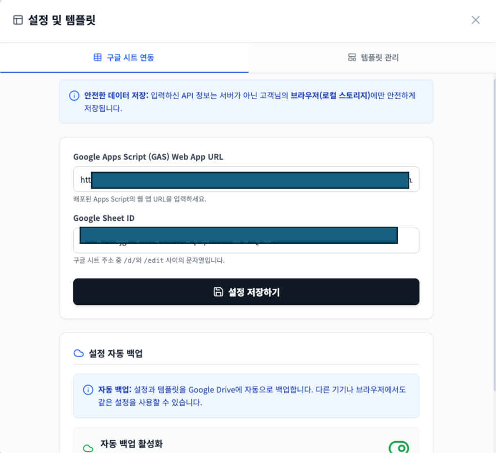
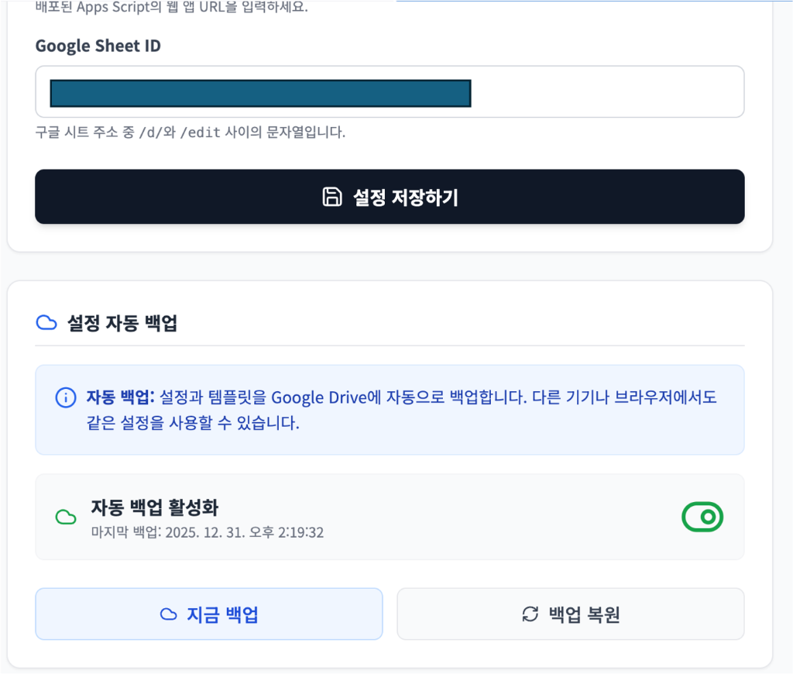
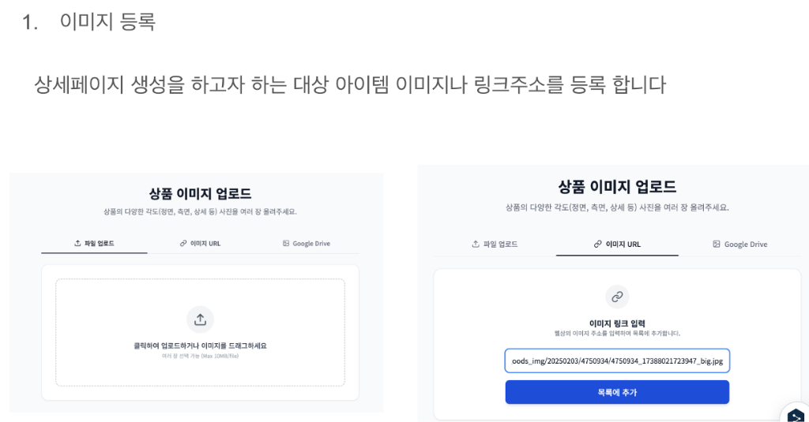
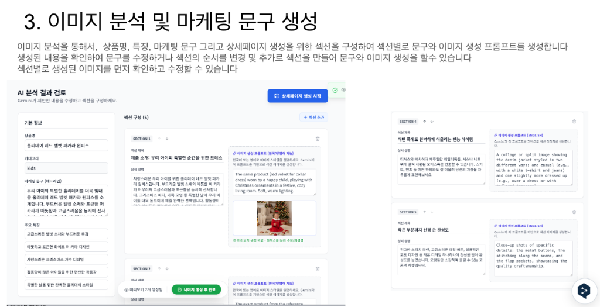

# 🛒 PageGenie (AI 상품 페이지 자동 생성)

**PageGenie**는 Google Gemini API(Multimodal)를 활용하여 이커머스 상품 상세페이지를 자동으로 기획, 디자인, 생성 및 현지화하는 웹 애플리케이션입니다.


## 1. 프로젝트 개요

이 프로젝트는 React 기반의 단일 페이지 애플리케이션(SPA)으로, 별도의 백엔드 서버 없이 **Google Apps Script (GAS)**를 활용하여 Serverless 환경에서 동작합니다.

### 🎯 핵심 기능 상세 (Key Features)

#### 1. AI 기반 기획 및 생성 (AI Planning & Generation)
- **다중 이미지 분석**: 상품의 정면, 측면, 제형 등 여러 장의 사진을 한 번에 분석하여 정확도를 높입니다.
- **자동 기획**: AI가 상품의 카테고리, 마케팅 소구점(Selling Point), 타겟 고객을 분석하여 상세페이지의 논리적인 구조(섹션)를 자동으로 설계합니다.
- **카피라이팅**: 각 섹션에 맞는 매력적인 헤드라인과 본문 텍스트를 자동으로 작성합니다.

#### 2. 섹션 편집 및 커스터마이징 (Section Editing)
사용자는 AI가 제안한 기획안을 자유롭게 수정할 수 있습니다.
- **섹션 추가/삭제**: 부족한 내용은 '섹션 추가'로 보완하고, 불필요한 부분은 삭제할 수 있습니다.
- **순서 변경**: 드래그 앤 드롭이나 버튼으로 섹션의 순서를 스토리라인에 맞게 조정할 수 있습니다.
- **내용 수정**: 마음에 들지 않는 문구 제목이나 본문을 직접 수정할 수 있습니다.

#### 3. 고급 이미지 생성 및 관리 (Advanced Image Control)
- **섹션별 이미지 생성**: 각 섹션의 맥락에 맞는 고퀄리티 이미지를 AI가 생성합니다.
- **프롬프트 수정 및 재생성**: 이미지가 마음에 들지 않으면 프롬프트를 수정하여 다시 생성할 수 있습니다.
- **이미지 업로드 (Custom Upload)**: AI 이미지가 아닌, 가지고 있는 특정 연출컷이나 디테일 컷을 직접 업로드하여 해당 섹션에 사용할 수 있습니다.

#### 4. 결과물 내보내기 및 저장 (Export & Save)
- **HTML 다운로드**: 완성된 상세페이지를 즉시 사용할 수 있는 HTML 파일로 제공합니다.
- **ZIP 패키지**: HTML 파일과 생성된 고화질 이미지들을 압축하여 한 번에 다운로드합니다.
- **클라우드 연동**: Google Apps Script 연동을 통해 프로젝트 데이터를 Google Sheet와 Drive에 안전하게 백업합니다.

---

## 2. 시작하기 (Getting Started)

이 프로젝트를 로컬 환경에서 실행하기 위한 방법입니다.

### 사전 요구사항
*   Node.js (최신 LTS 버전 권장)
*   npm

### 설치 및 실행

1. **저장소 클론 (Clone)**
   ```bash
   git clone https://github.com/710814/PageGenie-Public.git
   cd PageGenie-Public
   ```

2. **의존성 설치**
   ```bash
   npm install
   ```

3. **환경 변수 설정**
   루트 디렉토리에 `.env` 파일을 생성하고 Gemini API 키를 설정합니다. (GAS 프록시 사용 시 생략 가능하나 개발 편의를 위해 권장)
   ```bash
   VITE_GEMINI_API_KEY=your_api_key_here
   ```

4. **개발 서버 실행**
1.  **저장소 클론 (Clone)**
    ```bash
    git clone https://github.com/710814/PageGenie-Public.git
    cd PageGenie-Public
    ```

2.  **의존성 설치**
    ```bash
    npm install
    ```

3.  **환경 변수 설정**
    루트 디렉토리에 `.env` 파일을 생성하고 Gemini API 키를 설정합니다. (GAS 프록시 사용 시 생략 가능하나 개발 편의를 위해 권장)
    ```bash
    VITE_GEMINI_API_KEY=your_api_key_here
    ```

4.  **개발 서버 실행**
    ```bash
    npm run dev
    ```

---

### 3. Google Apps Script (GAS) 설정

⚠️ **중요**: 이 앱은 이미지 저장 및 데이터 관리를 위해 Google Apps Script 설정이 필수입니다.

#### 1단계: GAS 프로젝트 생성 및 코드 적용
1. [Google Apps Script](https://script.google.com/)에서 새 프로젝트를 생성합니다.
2. `GOOGLE_APPS_SCRIPT_CODE.js` 파일의 전체 내용을 복사하여 GAS 프로젝트의 `Code.gs`에 붙여넣습니다.

#### 2단계: Gemini API 키 설정
GAS 프로젝트 설정(톱니바퀴 아이콘) > **스크립트 속성(Script Properties)**에서 다음 속성을 추가합니다.
- **속성**: `GEMINI_API_KEY`
- **값**: `AIzaSy...` (발급받은 Gemini API 키)

#### 3단계: 웹 앱 배포
1. **배포** > **새 배포** > **웹 앱** 선택.
2. **실행 대상**: `나 (Me)` (중요: 그래야 내 드라이브에 접근 가능)
3. **액세스 권한**: `모든 사용자 (Anyone)`
4. 배포 후 생성된 **Web App URL**을 복사합니다 (`https://script.google.com/.../exec`).

---

### 4. 사용 방법 (User Guide)

#### 1단계: 초기 설정 (Initial Setup)
앱 실행 후 우측 상단의 **설정(⚙️)** 버튼을 눌러 GAS URL과 Sheet ID를 입력합니다.

<div align="center">
  
  <p><em>GAS Web App URL과 Google Sheet ID를 입력하고 '설정 저장하기'를 클릭합니다.</em></p>
  <br/>
  
  <p><em>설정 정보는 브라우저에 저장되며, Google Drive 자동 백업 기능을 켤 수 있습니다.</em></p>
</div>

#### 2단계: 이미지 등록 (Upload)
상세페이지를 생성할 상품의 이미지를 업로드합니다.
- **파일 업로드**: PC에 저장된 이미지를 드래그 앤 드롭하거나 선택합니다.
- **이미지 URL**: 웹상의 이미지 주소를 입력하여 가져올 수 있습니다.
- **다중 분석**: 정면, 측면, 상세 컷 등 여러 장을 올리면 AI가 더 정확하게 분석합니다.

<div align="center">
  
</div>

#### 3단계: AI 분석 및 기획 (Analysis)
AI가 이미지를 분석하여 상품명, 특징, 마케팅 문구를 자동으로 작성합니다.
- **섹션 구성**: AI가 제안한 상세페이지 구조(섹션)를 확인하고 수정할 수 있습니다.
- **프롬프트 수정**: 각 섹션의 이미지 생성 프롬프트를 미리 수정하거나, 섹션을 추가/삭제할 수 있습니다.

<div align="center">
  
</div>

#### 4단계: 상세페이지 생성 및 편집 (Generation)
"상세페이지 생성 시작" 버튼을 누르면 모든 섹션의 이미지가 생성되고 최종 결과물이 만들어집니다.
- **이미지 재생성**: 마음에 들지 않는 이미지는 클릭하여 프롬프트를 수정하고 다시 생성할 수 있습니다.
- **다운로드**: HTML 코드, 이미지 파일, 또는 전체 패키지(ZIP)로 다운로드하여 바로 사용할 수 있습니다.

<div align="center">
  
</div>

---

## 5. 기술 스택 (Tech Stack)

*   **Frontend**: React 19, TypeScript, Tailwind CSS
*   **AI**: Google Gemini API (`gemini-2.5-flash`)
*   **Backend**: Google Apps Script, Google Sheets, Google Drive
*   **Tools**: Lucide React, JSZip, FileSaver

---

## 5. 프로젝트 구조

```text
/
├── components/          # UI 컴포넌트 (업로드, 분석, 결과 화면 등)
├── services/            # 비즈니스 로직 (Gemini API, GAS 연동)
├── GOOGLE_APPS_SCRIPT_CODE.js  # GAS 배포용 코드
├── SETUP_GUIDE.md       # 상세 설정 가이드
└── ...
```
